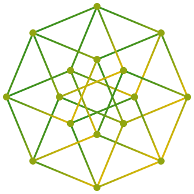

<!-- Don't delete it -->
<div name="readme-top"></div>

<!-- Organization Logo -->
<div align="center" style="display: flex; align-items: center; justify-content: center; gap: 16px;">
  
  
</div>

&nbsp;

<!-- Organization Name -->
<div align="center">

[](https://stability.nexus/)

<!-- Correct deployed url to be added -->

</div>

<!-- Organization/Project Social Handles -->
<p align="center">
<!-- Telegram -->
<a href="https://t.me/StabilityNexus">
</a>
&nbsp;&nbsp;
<!-- X (formerly Twitter) -->
<a href="https://x.com/StabilityNexus">
</a>
&nbsp;&nbsp;
<!-- Discord -->
<a href="https://discord.gg/YzDKeEfWtS">
</a>
&nbsp;&nbsp;
<!-- Blogs -->
<a href="https://viewpoints.stability.nexus/">
  </a>
&nbsp;&nbsp;
<!-- LinkedIn -->
<a href="https://linkedin.com/company/stability-nexus">
  </a>
&nbsp;&nbsp;
<!-- Youtube -->
<a href="https://www.youtube.com/@StabilityNexus">
  </a>
</p>

---

<div align="center">
<h1>MiniChain</h1>
</div>

MiniChain is a minimal fully functional blockchain implemented in Python.

### Background and Motivation

* Most well-known blockchains are now several years old and have accumulated a lot of technical debt.
  Simply forking their codebases is not an optimal option for starting a new chain.

* MiniChain will be focused on research. Its primary purpose is not to be yet another blockchain
  trying to be the one blockchain to kill them all, but rather to serve as a clean codebase that can be a benchmark for research of
  variations of the technology. (We hope that MiniChain will be as valuable for blockchain research as, for instance,
  MiniSat was valuable for satisfiability and automated reasoning research. MiniSat had less than 600 lines of C++ code.)

* MiniChain will be focused on education. By having a clean and small codebase, devs will be able to understand
  blockchains by looking at the codebase.

* The blockchain space is again going through a phase where many new blockchains are being launched.
  Back in 2017 and 2018, such an expansion period led to many general frameworks for blockchains,
  such as Scorex and various Hyperledger frameworks. But most of these frameworks suffered from speculative generality and
  were bloated. They focused on extensibility and configurability. MiniChain has a different philosophy:
  focus on minimality and, therefore, ease of modification.

* Recent advances in networking and crypto libraries for Python make it possible to develop MiniChain in Python.
  Given that Python is one of the easiest languages to learn and results in usually boilerplate-minimized and easy to read code,
  implementing MiniChain in Python aligns with MiniChain's educational goal.


### Resources

* Read this book:  https://www.marabu.dev/blockchain-foundations.pdf 

---

## Getting Started

### Prerequisites

- Python 3.10+
- Install dependencies:
  ```bash
  pip install -r requirements.txt
  ```

### 1. Creating a New MiniChain
To bootstrap a brand new blockchain network from scratch, simply start a node. By default, this creates a new Genesis block.
```bash
python main.py --port 9000 --datadir ./node1_data
```
*Note: Keep this terminal open to interact with the node via the CLI.*

### 2. Connecting to an Existing Chain
To connect a secondary node to the network, start a new instance on a different port and point it to the seed node using the `--connect` flag.
```bash
python main.py --port 9001 --connect 127.0.0.1:9000 --datadir ./node2_data
```
The node will automatically sync the blockchain state via the P2P network using the Fork-Choice rule.

### 3. Mining Blocks
To confirm pending transactions, you need to mine blocks. In the interactive CLI of your node, simply type:
```text
minichain> mine
```
This runs the Proof-of-Work algorithm, validates transactions, computes the new state root, updates your wallet with the block reward + fees, and broadcasts the block to all connected peers.

---

## Basic Operations (Interactive CLI)

Once your node is running, you can perform basic blockchain operations directly in your terminal.

**Making a Transfer**
Send coins to another public key:
```text
minichain> send <receiver_address> <amount> <fee>
```
*Example: `send 8b3401abedb875aff7279b5ab58cb9a0c... 100 1`*

**Checking Balances**
View the state of all active accounts and contracts on the chain:
```text
minichain> balance
```

**Viewing Network State**
```text
minichain> chain   # View all blocks
minichain> peers   # View connected P2P nodes
minichain> address # View your own public key
```

---

## Smart Contracts

MiniChain supports fully-functional smart contracts written directly in Python! 
The execution engine uses `sys.settrace` for precise **Gas Metering** (charging 1 gas per executed opcode) and `multiprocessing` for **Sandboxed Execution** to ensure network security.

### Writing a Contract
Smart contracts in MiniChain have access to a persistent `storage` dictionary and a `msg` dictionary containing transaction context (`sender`, `value`, `data`).

Check out the `/examples` directory for tutorials:
- `examples/counter.py` - A basic state mutation example.
- `examples/stablecoin.py` - A minimal ERC-20 style fungible token.
- `examples/dex.py` - An Automated Market Maker (AMM) using the constant product formula (x * y = k).

### Interacting via CLI
Start the interactive node using `python main.py` and use the following commands:
1. **Deploy:** `deploy <filepath> [amount] [fee]`
2. **Call:** `call <contract_address> <payload> [amount] [fee]`

Example deployment:
```text
minichain> deploy examples/counter.py 0 100
```

---

## JSON-RPC 2.0 Server

MiniChain automatically spins up a JSON-RPC 2.0 server alongside the P2P node. By default, it binds to `port 8545` (the standard EVM RPC port). External wallets and dApps can use this to interact with the chain asynchronously.

**Example Request (Get Block Number):**
```bash
curl -X POST http://127.0.0.1:8545/ \
  -H "Content-Type: application/json" \
  -d '{"jsonrpc": "2.0", "method": "mc_blockNumber", "id": 1}'
```

Available endpoints include: `mc_blockNumber`, `mc_getBlockByNumber`, `mc_getBalance`, and `mc_sendTransaction`.

---

## Contributing

We welcome contributions of all kinds!

If you encounter bugs, need help, or have feature requests:

- Please open an issue in this repository providing detailed information.
- Describe the problem clearly and include any relevant logs or screenshots.

We appreciate your feedback and contributions!

© 2025 The Stable Order.
